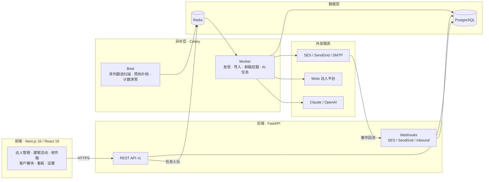

<div align="center">

# PUKOSTUDIO UGC

**达人建联 · 客户外联 · 收件箱智能化 — 一站式 Influencer Outreach 引擎**

*From discovery to reply — the full outreach lifecycle, automated.*

[](https://github.com/ZhewZhunglum/PUKOSTUDIO-UGC/actions/workflows/ci.yml)


[核心能力](#-核心能力) · [架构](#-架构) · [快速开始](#-快速开始) · [本地开发](#-本地开发) · [产品使用](#-产品使用) · [运维与排障](#-运维与排障)

</div>

---

## 📌 项目定位

PUKOSTUDIO UGC 是一套内部 **UGC / Influencer Outreach 建联系统**，覆盖从达人发现、联系方式挖掘、批量触达、自动跟进，到回复处理与数据复盘的完整闭环。系统同时服务两条业务线：

- **C 端（达人侧）**：达人库管理 → 建联活动 → 多步序列自动跟进 → 收件箱回复工作流
- **B 端（客户侧）**：客户库管理 → 客户建联活动 → 客户收件箱

AI 能力（意图分类、建议回复）为增强项而非强依赖——未配置 AI Provider 时系统自动降级为人工处理，核心链路不受影响。

## ✨ 核心能力

### 达人获取与管理

| 能力 | 说明 |
| --- | --- |
| 🔍 达人发现 | 对接 Woto 平台搜索 TikTok / Instagram / YouTube 达人，支持关键词（OR 拆分）、地区、垂类、粉丝数、互动率等组合筛选 |
| 📧 邮箱/电话挖掘 | 批量从达人主页、外链站点提取邮箱与电话，MX 校验兜底，Woto 联系方式补充 |
| 📥 智能导入 | CSV / Excel 导入，中英文表头智能映射，从视频/主页链接自动识别平台与用户名 |
| 📤 全量导出 | 达人、模板、活动结果、看板报表一键导出 Excel |

### 触达与送达率

| 能力 | 说明 |
| --- | --- |
| ✉️ 多通道发信 | Amazon SES / SendGrid / SMTP 三类发信账号，验证与健康状态管理 |
| 🔁 多步序列 | 1–5 步邮件序列，首封即发，跟进按延迟自动发送，回复/退信/退订即停 |
| 🧪 A/B 主题测试 | 50/50 确定性分流，活动详情页对比打开率 |
| ⏰ 发送时间窗口 | 按收件人时区限定发送时段 |
| 🛡️ 送达率保障 | 抑制名单、一键退订、预热爬坡、发送前校验、每日限额 |
| 📈 追踪与回执 | 打开追踪、SES / SendGrid Webhook 事件回流（含 SNS 订阅自动确认）、实时发送进度 |

### 回复与智能化

| 能力 | 说明 |
| --- | --- |
| 📬 双收件箱 | 达人收件箱 + 客户收件箱，入站邮件自动归线程 |
| 🤖 AI 工作流 | 意图分类、建议回复草稿（Claude / OpenAI 可切换），未配置时优雅降级 |
| 📝 富文本 | 签名 / 正文 / 回复全链路 HTML 富文本，附件与图片上传 |
| 📊 数据看板 | 达人数、活动数、发送量、打开率、回复率、退信率等真实统计 |

## 🏗 架构



**技术选型**

| 层 | 技术 |
| --- | --- |
| 前端 | Next.js 16 · React 19 · TypeScript 5 · Tailwind CSS · shadcn/ui |
| 后端 | FastAPI · SQLAlchemy 2 (async) · Alembic · Pydantic v2 |
| 异步任务 | Celery 5 (worker + beat) · Redis |
| 数据库 | PostgreSQL |
| 集成 | Amazon SES · SendGrid · SMTP · Woto · Claude / OpenAI |

**目录结构**

```text
.
├── backend/
│   ├── app/
│   │   ├── api/v1/          # REST 路由 + Webhooks
│   │   ├── models/          # SQLAlchemy 模型
│   │   ├── schemas/         # Pydantic 模型
│   │   ├── services/        # 业务逻辑层
│   │   ├── integrations/    # SES / SendGrid / SMTP / Woto / AI / 邮箱挖掘
│   │   ├── workers/         # Celery 任务
│   │   └── core/            # 配置 · 数据库 · 通用工具
│   ├── alembic/             # 数据库迁移
│   └── tests/
├── frontend/
│   └── src/
│       ├── app/             # App Router 页面
│       ├── components/      # UI 组件（shadcn/ui）
│       └── lib/             # API Client · Auth · Hooks
├── scripts/                 # 开发辅助脚本（mock API 等）
└── docker-compose.yml
```

## 🚀 快速开始

> 前置要求：Docker + Docker Compose

```bash
# 1. 准备环境变量
cp .env.example .env

# 2. 拉起完整本地栈（Postgres + Redis + Backend + Frontend + Worker + Beat）
docker compose up --build

# 3. 首次启动后，另开终端执行数据库迁移
docker compose exec backend alembic upgrade head
```

| 服务 | 地址 |
| --- | --- |
| 前端 | http://localhost:4317 |
| 后端 API | http://localhost:8917 |
| API 文档（Swagger） | http://localhost:8917/docs |
| 健康检查 | http://localhost:8917/health |

只需要基础设施、前后端本地跑的场景：

```bash
docker compose up postgres redis
```

## ⚙️ 环境变量

复制 `.env.example` 为 `.env` 后按需修改，关键分组：

| 分组 | 变量 | 必需 |
| --- | --- | :---: |
| 数据库 | `DATABASE_URL` · `DATABASE_URL_SYNC` | ✅ |
| Redis | `REDIS_URL` | ✅ |
| 认证 | `SECRET_KEY` | ✅ |
| 前端/API | `FRONTEND_URL` · `NEXT_PUBLIC_API_URL` | ✅ |
| AI | `AI_PROVIDER` · `CLAUDE_API_KEY` / `OPENAI_API_KEY` | 可选 |
| Amazon SES | `SES_ACCESS_KEY_ID` · `SES_SECRET_ACCESS_KEY` · `SES_REGION` | 按需 |
| SendGrid | `SENDGRID_API_KEY` | 按需 |
| SMTP | `SMTP_HOST` · `SMTP_PORT` · `SMTP_USERNAME` · `SMTP_PASSWORD` · `SMTP_USE_TLS` | 按需 |

> **AI 为可选依赖**：未配置 AI Provider 时，收件箱自动降级为人工处理，页面不会因缺少 key 而不可用。

## 🛠 本地开发

### 后端

```bash
cd backend
python3 -m venv .venv
source .venv/bin/activate        # Windows: .venv\Scripts\activate
python3 -m pip install --upgrade pip
python3 -m pip install -e ".[dev]"
alembic upgrade head
uvicorn app.main:app --reload --port 8917
```

### Celery Worker（发信 / 导入 / 挖掘 / AI 任务）

```bash
cd backend && source .venv/bin/activate
celery -A app.workers.celery_app worker --loglevel=info --concurrency=4
```

### Celery Beat（序列跟进扫描 · 预热升档 · 每日计数清零）

```bash
cd backend && source .venv/bin/activate
celery -A app.workers.celery_app beat --loglevel=info
```

> Worker 与 Beat 在开发和生产环境都应保持运行，否则发信与自动跟进不会执行。

### 前端

```bash
cd frontend
npm ci
npm run dev
```

### 质量检查

提交前请在本地跑通与 CI 一致的检查：

```bash
# 后端
cd backend && python3 -m pytest -q && ruff check .

# 前端
cd frontend && npm run lint && npm run build
```

数据库结构变更：

```bash
cd backend
alembic revision --autogenerate -m "describe change"
alembic upgrade head
```

## 📖 产品使用

首次登录后，按以下路径跑通第一条完整建联链路：

```
注册/登录 → 设置·邮箱账号 → 邮件模板 → 达人管理 → 建联活动 → 收件箱 → 数据看板
```

1. **设置 → 邮箱账号**：新增 `SES` / `SendGrid` / `SMTP` 账号，保存后点击验证
2. **邮件模板**：创建首封建联模板，正文支持 `{{name}}` `{{first_name}}` `{{email}}` `{{niche}}` `{{country}}` `{{platform}}` `{{username}}` `{{followers}}` 变量
3. **达人管理**：手动新增、批量导入（CSV/Excel），或从 **达人发现** 检索入库并批量挖掘邮箱
4. **建联活动**：创建活动、配置 1–5 步序列，选择达人入组后启动
5. **收件箱**：查看入站回复、AI 意图与建议草稿，人工确认后发送
6. **数据看板**：复盘发送量、打开率、回复率、退信率

B 端链路同理：**客户管理 → 客户建联活动 → 客户收件箱**，支持 Excel 导入导出。

### 达人导入表头

支持中英文表头智能映射（如 `作者`→name、`邮箱`→email、`粉丝数`→followers），并可从视频/主页链接自动识别平台与用户名。推荐格式：

```csv
name,email,niche,country,platform,username,followers
Jane Creator,jane@example.com,beauty,US,tiktok,janeugc,12000
```

`name` 为必填；无邮箱的达人可先入库，走邮箱挖掘补全后再进入发信链路。

### 发信账号凭证

| 类型 | 所需字段 |
| --- | --- |
| SES | `region` · `access_key_id` · `secret_access_key` |
| SendGrid | `api_key` |
| SMTP | `host` · `port` · `username` · `password` · `use_tls` |

敏感字段保存后不会完整回传前端；更新账号时需重新填写要更换的密钥字段。

## 🔧 运维与排障

### 健康检查

`GET /health` 分组返回各组件状态：

| 组件 | 说明 |
| --- | --- |
| `app` | FastAPI 应用状态 |
| `db` | 数据库连接 |
| `redis` | Redis 连接 |
| `worker` | 后台 Worker 心跳（异常时页面可浏览，但发信/AI 任务不执行） |

### 常用命令

```bash
docker compose ps                          # 服务状态
docker compose logs -f backend             # 后端日志
docker compose logs -f celery-worker       # Worker 日志
docker compose exec backend alembic upgrade head   # 迁移
```

### 常见问题

| 现象 | 排查方向 |
| --- | --- |
| 前端请求失败 | `NEXT_PUBLIC_API_URL` 是否指向 `http://localhost:8917`；后端是否已启动 |
| 登录后空白/跳回登录 | 后端 token 接口是否正常；清理浏览器 local storage 中旧环境残留 token |
| 数据库表不存在 | 执行 `alembic upgrade head` |
| 邮件未发送 | 邮箱账号已验证？Worker 在运行？达人有邮箱？活动已启动？ |
| 收件箱无 AI 草稿 | 是否配置 `AI_PROVIDER` 与对应 key；未配置时自动降级人工处理 |
| 导入失败 | 文件为 `.csv` / `.xlsx` 且至少包含 `name`（或 `作者`）列 |
| `python` 不可用 | 本项目文档统一使用 `python3` |

## 🔄 CI

每次 push / PR 自动运行：

| Job | 检查项 |
| --- | --- |
| `backend` | `pytest -q` · `ruff check .` |
| `frontend` | `npm run lint` · `npm run build` |

---

<div align="center">

**PUKOSTUDIO UGC** — Internal Influencer Outreach Engine

*Built with FastAPI · Next.js · Celery · PostgreSQL*

</div>
